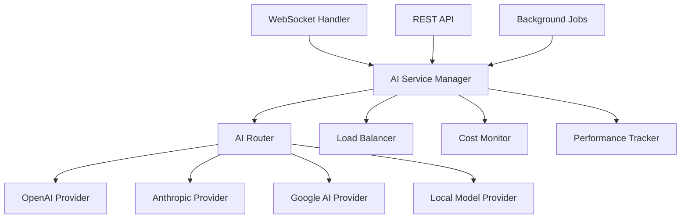
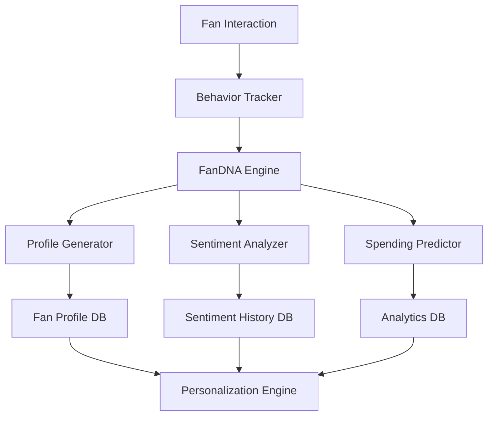

# AI Creator Assistant Suite Design Document

## Overview

The AI Creator Assistant Suite transforms VYRA into an intelligent platform by integrating multiple AI providers and advanced analytics capabilities. The system provides personalized AI assistance, comprehensive fan profiling through FanDNA™, real-time sentiment analysis, multimedia processing, predictive analytics, and automated workflows.

## Architecture

### Multi-Provider AI Architecture



### FanDNA™ System Architecture



## Components and Interfaces

### 1. AI Provider Management

**AIProviderInterface**
```typescript
interface AIProvider {
  name: string;
  generateResponse(prompt: string, options: AIOptions): Promise<AIResponse>;
  analyzeContent(content: string): Promise<ContentAnalysis>;
  transcribeAudio(audioData: Buffer): Promise<Transcription>;
  analyzeSentiment(text: string): Promise<SentimentResult>;
}
```

**AIRouter**
- Routes requests to optimal AI provider based on task type, cost, and performance
- Implements fallback mechanisms for provider failures
- Manages rate limiting and quota distribution

### 2. FanDNA™ Profiling System

**FanProfile**
```typescript
interface FanProfile {
  id: string;
  userId: string;
  creatorId: string;
  behaviorMetrics: BehaviorMetrics;
  preferences: UserPreferences;
  sentimentHistory: SentimentTrend[];
  spendingPattern: SpendingAnalysis;
  engagementScore: number;
  monetizationPotential: number;
  lastUpdated: Date;
}
```

**BehaviorTracker**
- Captures all fan interactions (messages, reactions, purchases, time spent)
- Analyzes communication patterns and engagement frequency
- Tracks content preferences and response patterns

### 3. Real-time AI Processing

**WebSocket AI Handler**
- Processes incoming messages for sentiment analysis
- Generates response suggestions in real-time
- Triggers FanDNA™ profile updates
- Manages AI-powered notifications and alerts

### 4. Content Optimization Engine

**ContentOptimizer**
```typescript
interface ContentOptimizer {
  analyzeContent(content: Content): Promise<OptimizationSuggestions>;
  optimizeForEngagement(content: Content): Promise<OptimizedContent>;
  suggestHashtags(content: Content): Promise<string[]>;
  recommendPostingTime(creatorId: string): Promise<Date>;
}
```

### 5. Predictive Analytics Engine

**AnalyticsEngine**
- Revenue forecasting using historical data and trends
- Fan lifetime value prediction
- Content performance prediction
- Churn risk analysis

### 6. Automated Workflow Engine

**WorkflowEngine**
- Rule-based automation for common tasks
- AI-powered decision making for complex scenarios
- Integration with external platforms and services
- Customizable workflow templates

## Data Models

### Enhanced Database Schema

#### Fan Behavior Profiles
```sql
CREATE TABLE fan_profiles (
    id TEXT PRIMARY KEY,
    user_id TEXT NOT NULL REFERENCES users(id),
    creator_id TEXT NOT NULL REFERENCES users(id),
    engagement_score DECIMAL(5,2) DEFAULT 0,
    monetization_potential DECIMAL(5,2) DEFAULT 0,
    preferred_communication_time TEXT,
    content_preferences JSON,
    spending_tier VARCHAR(20),
    last_interaction DATETIME,
    profile_data JSON,
    created_at DATETIME DEFAULT CURRENT_TIMESTAMP,
    updated_at DATETIME DEFAULT CURRENT_TIMESTAMP
);
```

#### AI Model Performance Metrics
```sql
CREATE TABLE ai_model_metrics (
    id TEXT PRIMARY KEY,
    provider_name VARCHAR(50) NOT NULL,
    model_name VARCHAR(100) NOT NULL,
    request_type VARCHAR(50) NOT NULL,
    response_time_ms INTEGER NOT NULL,
    cost_per_request DECIMAL(10,6),
    accuracy_score DECIMAL(3,2),
    success_rate DECIMAL(3,2),
    timestamp DATETIME DEFAULT CURRENT_TIMESTAMP
);
```

#### Content Optimization History
```sql
CREATE TABLE content_optimization_history (
    id TEXT PRIMARY KEY,
    creator_id TEXT NOT NULL REFERENCES users(id),
    original_content TEXT NOT NULL,
    optimized_content TEXT NOT NULL,
    optimization_type VARCHAR(50) NOT NULL,
    suggestions JSON,
    performance_metrics JSON,
    was_used BOOLEAN DEFAULT FALSE,
    created_at DATETIME DEFAULT CURRENT_TIMESTAMP
);
```

#### Sentiment Analysis Results
```sql
CREATE TABLE sentiment_analysis_results (
    id TEXT PRIMARY KEY,
    message_id TEXT REFERENCES messages(id),
    conversation_id TEXT NOT NULL REFERENCES conversations(id),
    user_id TEXT NOT NULL REFERENCES users(id),
    sentiment_score DECIMAL(3,2) NOT NULL,
    sentiment_label VARCHAR(20) NOT NULL,
    emotion_tags JSON,
    confidence_score DECIMAL(3,2),
    analysis_provider VARCHAR(50),
    created_at DATETIME DEFAULT CURRENT_TIMESTAMP
);
```

#### Predictive Analytics Data
```sql
CREATE TABLE predictive_analytics (
    id TEXT PRIMARY KEY,
    creator_id TEXT NOT NULL REFERENCES users(id),
    prediction_type VARCHAR(50) NOT NULL,
    prediction_data JSON NOT NULL,
    confidence_interval JSON,
    actual_outcome JSON,
    accuracy_score DECIMAL(3,2),
    created_at DATETIME DEFAULT CURRENT_TIMESTAMP,
    expires_at DATETIME
);
```

## Error Handling

### AI Provider Failures
- Automatic failover to backup providers
- Graceful degradation when AI services are unavailable
- Retry mechanisms with exponential backoff
- User notification for critical AI service failures

### Data Processing Errors
- Validation of AI responses before storage
- Fallback to cached results when real-time processing fails
- Error logging and monitoring for debugging
- Data consistency checks and recovery procedures

## Testing Strategy

### Unit Testing
- AI provider interface implementations
- FanDNA™ profile generation algorithms
- Sentiment analysis accuracy validation
- Content optimization effectiveness

### Integration Testing
- Multi-provider AI routing and failover
- Real-time WebSocket AI processing
- Database operations and data consistency
- External API integrations

### Performance Testing
- AI response time benchmarks
- Concurrent user load testing
- Database query optimization validation
- Memory usage and resource monitoring

### AI Model Testing
- A/B testing for AI-generated content
- Accuracy validation against human baselines
- Bias detection and mitigation testing
- Privacy and security compliance validation