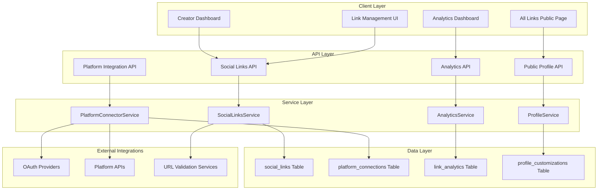

# Design Document

## Overview

The Creator Social Integration feature extends VYRA's platform to provide creators with a centralized social presence management system. This includes an "All Links" page generator similar to Linktree and seamless integration with external creator platforms like OnlyFans, Fansly, and other adult content platforms. The design leverages VYRA's existing cyberpunk aesthetic, user authentication system, and database architecture while introducing new services for social link management, platform integrations, and analytics tracking.

## Architecture

### High-Level Architecture



### Database Schema Extensions

The design extends the existing SQLite schema with four new tables that integrate with the current user system:

```sql
-- Social links for creators' All Links pages
CREATE TABLE social_links (
    id TEXT PRIMARY KEY DEFAULT (lower(hex(randomblob(16)))),
    user_id TEXT NOT NULL REFERENCES users(id) ON DELETE CASCADE,
    platform_type VARCHAR(50) NOT NULL, -- 'twitter', 'instagram', 'tiktok', 'custom'
    platform_name VARCHAR(100) NOT NULL, -- Display name
    url TEXT NOT NULL,
    display_order INTEGER NOT NULL DEFAULT 0,
    is_active BOOLEAN DEFAULT TRUE,
    click_count INTEGER DEFAULT 0,
    created_at DATETIME DEFAULT CURRENT_TIMESTAMP,
    updated_at DATETIME DEFAULT CURRENT_TIMESTAMP
);

-- Connected creator platform accounts
CREATE TABLE platform_connections (
    id TEXT PRIMARY KEY DEFAULT (lower(hex(randomblob(16)))),
    user_id TEXT NOT NULL REFERENCES users(id) ON DELETE CASCADE,
    platform_type VARCHAR(50) NOT NULL, -- 'onlyfans', 'fansly', 'manyvids'
    platform_username VARCHAR(100) NOT NULL,
    connection_method VARCHAR(20) NOT NULL, -- 'oauth', 'manual'
    encrypted_tokens TEXT, -- OAuth tokens encrypted with AES-256
    verification_status VARCHAR(20) DEFAULT 'pending', -- 'pending', 'verified', 'failed'
    is_public BOOLEAN DEFAULT TRUE, -- Show on All Links page
    last_sync_at DATETIME,
    created_at DATETIME DEFAULT CURRENT_TIMESTAMP,
    updated_at DATETIME DEFAULT CURRENT_TIMESTAMP
);

-- Analytics for link clicks and page views
CREATE TABLE link_analytics (
    id TEXT PRIMARY KEY DEFAULT (lower(hex(randomblob(16)))),
    user_id TEXT NOT NULL REFERENCES users(id) ON DELETE CASCADE,
    link_id TEXT REFERENCES social_links(id) ON DELETE CASCADE,
    event_type VARCHAR(20) NOT NULL, -- 'page_view', 'link_click'
    referrer TEXT,
    user_agent TEXT,
    ip_address TEXT,
    created_at DATETIME DEFAULT CURRENT_TIMESTAMP
);

-- Profile customization settings
CREATE TABLE profile_customizations (
    id TEXT PRIMARY KEY DEFAULT (lower(hex(randomblob(16)))),
    user_id TEXT NOT NULL REFERENCES users(id) ON DELETE CASCADE,
    theme VARCHAR(20) DEFAULT 'cyberpunk', -- 'cyberpunk', 'minimal', 'colorful'
    bio TEXT,
    profile_image_url TEXT,
    background_color VARCHAR(7), -- Hex color
    accent_color VARCHAR(7), -- Hex color
    custom_css TEXT,
    created_at DATETIME DEFAULT CURRENT_TIMESTAMP,
    updated_at DATETIME DEFAULT CURRENT_TIMESTAMP,
    UNIQUE(user_id)
);
```

## Components and Interfaces

### 1. SocialLinksService

Manages CRUD operations for social media links and custom links.

```typescript
interface SocialLink {
  id: string;
  user_id: string;
  platform_type: string;
  platform_name: string;
  url: string;
  display_order: number;
  is_active: boolean;
  click_count: number;
  created_at: Date;
  updated_at: Date;
}

class SocialLinksService {
  async createLink(userId: string, linkData: CreateLinkData): Promise<SocialLink>
  async updateLink(linkId: string, updates: Partial<SocialLink>): Promise<SocialLink>
  async deleteLink(linkId: string): Promise<boolean>
  async getUserLinks(userId: string, includeInactive?: boolean): Promise<SocialLink[]>
  async reorderLinks(userId: string, linkIds: string[]): Promise<void>
  async incrementClickCount(linkId: string): Promise<void>
  async validateUrl(url: string): Promise<boolean>
}
```

### 2. PlatformConnectorService

Handles OAuth flows and manual verification for external creator platforms.

```typescript
interface PlatformConnection {
  id: string;
  user_id: string;
  platform_type: string;
  platform_username: string;
  connection_method: 'oauth' | 'manual';
  encrypted_tokens?: string;
  verification_status: 'pending' | 'verified' | 'failed';
  is_public: boolean;
  last_sync_at?: Date;
  created_at: Date;
  updated_at: Date;
}

class PlatformConnectorService {
  async initiateOAuthFlow(userId: string, platform: string): Promise<string> // Returns auth URL
  async handleOAuthCallback(code: string, state: string): Promise<PlatformConnection>
  async manualVerification(userId: string, platform: string, username: string): Promise<PlatformConnection>
  async disconnectPlatform(connectionId: string): Promise<boolean>
  async getUserConnections(userId: string): Promise<PlatformConnection[]>
  async syncPlatformData(connectionId: string): Promise<void>
  async verifyConnection(connectionId: string): Promise<boolean>
}
```

### 3. ProfileService

Manages public profile pages and customization settings.

```typescript
interface ProfileCustomization {
  id: string;
  user_id: string;
  theme: 'cyberpunk' | 'minimal' | 'colorful';
  bio?: string;
  profile_image_url?: string;
  background_color?: string;
  accent_color?: string;
  custom_css?: string;
  created_at: Date;
  updated_at: Date;
}

interface PublicProfile {
  user: UserPublic;
  customization: ProfileCustomization;
  social_links: SocialLink[];
  platform_connections: PlatformConnection[];
  stats: {
    total_links: number;
    total_clicks: number;
    page_views: number;
  };
}

class ProfileService {
  async getPublicProfile(username: string): Promise<PublicProfile | null>
  async updateCustomization(userId: string, updates: Partial<ProfileCustomization>): Promise<ProfileCustomization>
  async generateProfileUrl(username: string): Promise<string>
  async validateCustomCss(css: string): Promise<boolean>
}
```

### 4. AnalyticsService

Tracks and aggregates analytics data for creators.

```typescript
interface AnalyticsEvent {
  id: string;
  user_id: string;
  link_id?: string;
  event_type: 'page_view' | 'link_click';
  referrer?: string;
  user_agent?: string;
  ip_address?: string;
  created_at: Date;
}

interface AnalyticsData {
  total_page_views: number;
  unique_visitors: number;
  total_clicks: number;
  link_performance: Array<{
    link_id: string;
    platform_name: string;
    clicks: number;
    ctr: number;
  }>;
  time_series: Array<{
    date: string;
    page_views: number;
    clicks: number;
  }>;
}

class AnalyticsService {
  async trackEvent(event: Omit<AnalyticsEvent, 'id' | 'created_at'>): Promise<void>
  async getAnalytics(userId: string, period: 'day' | 'week' | 'month'): Promise<AnalyticsData>
  async getLinkPerformance(userId: string): Promise<LinkPerformance[]>
  async getTopReferrers(userId: string): Promise<ReferrerData[]>
}
```

## Data Models

### Extended User Types

```typescript
// Extend existing User interface
interface CreatorProfile extends UserPublic {
  profile_url: string; // Generated vyra.com/creator/[username]
  social_links_count: number;
  connected_platforms_count: number;
  total_link_clicks: number;
}
```

### Platform Integration Types

```typescript
type SupportedPlatform = 
  | 'onlyfans' 
  | 'fansly' 
  | 'manyvids' 
  | 'chaturbate' 
  | 'cam4' 
  | 'stripchat'
  | 'twitter'
  | 'instagram'
  | 'tiktok'
  | 'youtube'
  | 'twitch'
  | 'custom';

interface PlatformConfig {
  name: string;
  oauth_enabled: boolean;
  oauth_client_id?: string;
  oauth_client_secret?: string;
  oauth_scopes?: string[];
  verification_method: 'oauth' | 'manual' | 'both';
  icon_url: string;
  color: string;
}
```

## Error Handling

### Service-Level Error Handling

```typescript
class SocialIntegrationError extends Error {
  constructor(
    message: string,
    public code: string,
    public statusCode: number = 400
  ) {
    super(message);
    this.name = 'SocialIntegrationError';
  }
}

// Error codes
const ERROR_CODES = {
  INVALID_URL: 'INVALID_URL',
  PLATFORM_NOT_SUPPORTED: 'PLATFORM_NOT_SUPPORTED',
  OAUTH_FAILED: 'OAUTH_FAILED',
  VERIFICATION_FAILED: 'VERIFICATION_FAILED',
  RATE_LIMIT_EXCEEDED: 'RATE_LIMIT_EXCEEDED',
  DUPLICATE_CONNECTION: 'DUPLICATE_CONNECTION',
} as const;
```

### API Error Responses

```typescript
interface ErrorResponse {
  error: {
    code: string;
    message: string;
    details?: any;
  };
  timestamp: string;
}
```

## Testing Strategy

### Unit Testing

1. **Service Layer Tests**
   - SocialLinksService CRUD operations
   - PlatformConnectorService OAuth flows
   - AnalyticsService data aggregation
   - ProfileService public profile generation

2. **Database Layer Tests**
   - Schema validation
   - Foreign key constraints
   - Index performance
   - Migration scripts

### Integration Testing

1. **API Endpoint Tests**
   - Authentication middleware
   - Request validation
   - Response formatting
   - Error handling

2. **External Service Tests**
   - OAuth provider mocks
   - URL validation services
   - Platform API integrations

### End-to-End Testing

1. **User Workflows**
   - Creator adds social links
   - Creator connects platform accounts
   - Fan visits All Links page
   - Analytics tracking accuracy

2. **Security Testing**
   - OAuth token encryption
   - SQL injection prevention
   - XSS protection
   - Rate limiting

## Security Considerations

### Data Protection

1. **OAuth Token Encryption**
   - Use existing EncryptionService with AES-256
   - Store encrypted tokens in database
   - Implement token refresh mechanisms

2. **URL Validation**
   - Validate all URLs before storage
   - Prevent malicious redirects
   - Sanitize user input

3. **Rate Limiting**
   - Implement per-user rate limits for API calls
   - Prevent abuse of analytics tracking
   - Limit OAuth attempts

### Privacy Controls

1. **Public Profile Settings**
   - Allow creators to control visibility
   - Respect platform connection privacy settings
   - Implement granular permissions

2. **Analytics Privacy**
   - Hash IP addresses for privacy
   - Aggregate data to prevent individual tracking
   - Comply with privacy regulations

## Performance Optimization

### Database Optimization

1. **Indexing Strategy**
   - Index on user_id for all tables
   - Composite indexes for analytics queries
   - Optimize for read-heavy workloads

2. **Caching Strategy**
   - Cache public profiles with Redis (future enhancement)
   - Cache analytics data for dashboard views
   - Implement cache invalidation on updates

### API Performance

1. **Response Optimization**
   - Paginate analytics data
   - Lazy load platform connections
   - Compress API responses

2. **Background Processing**
   - Queue platform data syncing
   - Batch analytics processing
   - Async OAuth token refresh

## Deployment Considerations

### Environment Variables

```bash
# OAuth Configuration
OAUTH_ONLYFANS_CLIENT_ID=
OAUTH_ONLYFANS_CLIENT_SECRET=
OAUTH_TWITTER_CLIENT_ID=
OAUTH_TWITTER_CLIENT_SECRET=

# External Services
URL_VALIDATION_API_KEY=
ANALYTICS_ENCRYPTION_KEY=

# Feature Flags
ENABLE_PLATFORM_CONNECTIONS=true
ENABLE_CUSTOM_CSS=false
```

### Database Migrations

1. **Migration Scripts**
   - Add new tables with proper constraints
   - Create indexes for performance
   - Populate default customization records

2. **Rollback Strategy**
   - Maintain backward compatibility
   - Implement safe rollback procedures
   - Test migration scripts thoroughly

This design provides a comprehensive foundation for implementing the Creator Social Integration feature while maintaining consistency with VYRA's existing architecture and cyberpunk aesthetic.