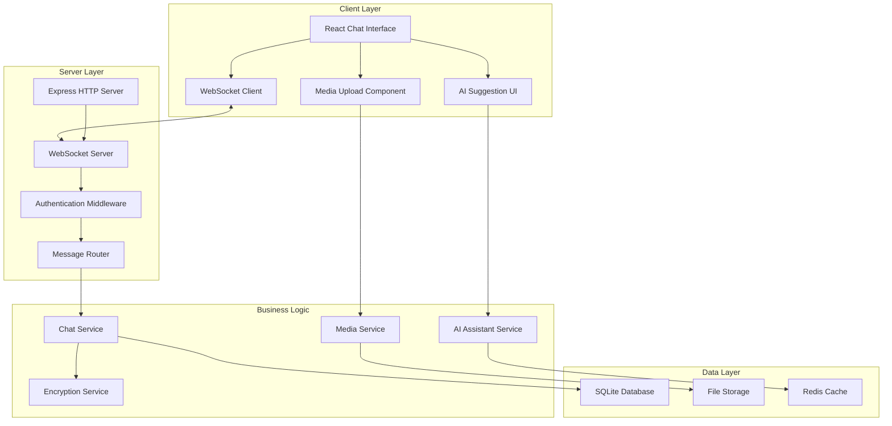

# Design Document

## Overview

The Real-time WebSocket Chat System will transform VYRA from a static mockup into a fully functional AI-powered creator platform. This system serves as the foundational infrastructure enabling real-time bidirectional communication between creators and fans, supporting rich media sharing, AI assistant integration, and monetization features.

The design leverages WebSocket technology for real-time communication, integrates with the existing Express server architecture, and maintains the cyberpunk aesthetic while providing enterprise-grade security and scalability. The system will handle multiple concurrent conversations, persist messages with encryption, and provide the infrastructure for AI-powered features like FanDNA™ profiles and adaptive paywalls.

## Architecture

### High-Level Architecture



### Technology Stack

- **Frontend**: React 18 with TypeScript, existing shadcn/ui components
- **WebSocket**: Native WebSocket API with reconnection logic
- **Backend**: Express.js with WebSocket server integration
- **Database**: SQLite for development, PostgreSQL for production
- **Caching**: In-memory cache with Redis option for production
- **File Storage**: Local filesystem for development, cloud storage for production
- **Encryption**: Node.js crypto module for AES-256 encryption
- **AI Integration**: OpenAI API for response suggestions and content analysis

## Components and Interfaces

### WebSocket Connection Manager

```typescript
interface WebSocketManager {
  connect(userId: string, token: string): Promise<WebSocket>;
  disconnect(): void;
  send(message: ChatMessage): void;
  onMessage(callback: (message: ChatMessage) => void): void;
  onConnectionChange(callback: (status: ConnectionStatus) => void): void;
  reconnect(): Promise<void>;
}

interface ConnectionStatus {
  connected: boolean;
  reconnecting: boolean;
  lastConnected?: Date;
  retryCount: number;
}
```

### Chat Message System

```typescript
interface ChatMessage {
  id: string;
  conversationId: string;
  senderId: string;
  senderRole: 'creator' | 'fan' | 'ai';
  content: string;
  messageType: 'text' | 'media' | 'system';
  media?: MediaAttachment;
  timestamp: Date;
  encrypted: boolean;
  deliveryStatus: 'sending' | 'sent' | 'delivered' | 'failed';
}

interface MediaAttachment {
  id: string;
  type: 'image' | 'video' | 'voice' | 'file';
  url: string;
  thumbnailUrl?: string;
  size: number;
  duration?: number; // for audio/video
  dimensions?: { width: number; height: number }; // for images/video
}

interface Conversation {
  id: string;
  participants: Participant[];
  lastMessage?: ChatMessage;
  unreadCount: number;
  isPinned: boolean;
  createdAt: Date;
  updatedAt: Date;
}

interface Participant {
  id: string;
  name: string;
  avatar?: string;
  role: 'creator' | 'fan';
  tier: 'standard' | 'premium' | 'vip';
  isOnline: boolean;
  lastSeen?: Date;
  isVerified: boolean;
}
```

### AI Assistant Integration

```typescript
interface AIAssistant {
  analyzeMessage(message: ChatMessage, context: ConversationContext): Promise<AIAnalysis>;
  generateSuggestions(analysis: AIAnalysis): Promise<ResponseSuggestion[]>;
  detectMonetizationOpportunity(conversation: ChatMessage[]): Promise<MonetizationSuggestion[]>;
}

interface AIAnalysis {
  sentiment: 'positive' | 'neutral' | 'negative';
  intent: 'question' | 'compliment' | 'request' | 'purchase_interest' | 'general';
  topics: string[];
  urgency: 'low' | 'medium' | 'high';
  monetizationPotential: number; // 0-1 score
}

interface ResponseSuggestion {
  id: string;
  text: string;
  type: 'quick_reply' | 'offer' | 'question' | 'engagement';
  confidence: number;
  icon?: string;
}

interface MonetizationSuggestion {
  type: 'tip_request' | 'content_offer' | 'tier_upgrade' | 'custom_request';
  title: string;
  description: string;
  suggestedPrice?: number;
  confidence: number;
}
```

### Media Upload System

```typescript
interface MediaUploadService {
  uploadFile(file: File, conversationId: string): Promise<MediaUploadResult>;
  generateThumbnail(file: File): Promise<string>;
  validateFile(file: File): ValidationResult;
  getUploadProgress(uploadId: string): UploadProgress;
}

interface MediaUploadResult {
  success: boolean;
  mediaId?: string;
  url?: string;
  thumbnailUrl?: string;
  error?: string;
}

interface ValidationResult {
  valid: boolean;
  errors: string[];
  warnings: string[];
}

interface UploadProgress {
  uploadId: string;
  progress: number; // 0-100
  status: 'uploading' | 'processing' | 'complete' | 'error';
  estimatedTimeRemaining?: number;
}
```

## Data Models

### Database Schema

```sql
-- Users table
CREATE TABLE users (
    id UUID PRIMARY KEY DEFAULT gen_random_uuid(),
    username VARCHAR(50) UNIQUE NOT NULL,
    email VARCHAR(255) UNIQUE NOT NULL,
    password_hash VARCHAR(255) NOT NULL,
    role VARCHAR(20) NOT NULL CHECK (role IN ('creator', 'fan')),
    tier VARCHAR(20) DEFAULT 'standard' CHECK (tier IN ('standard', 'premium', 'vip')),
    avatar_url TEXT,
    is_verified BOOLEAN DEFAULT FALSE,
    is_online BOOLEAN DEFAULT FALSE,
    last_seen TIMESTAMP,
    created_at TIMESTAMP DEFAULT CURRENT_TIMESTAMP,
    updated_at TIMESTAMP DEFAULT CURRENT_TIMESTAMP
);

-- Conversations table
CREATE TABLE conversations (
    id UUID PRIMARY KEY DEFAULT gen_random_uuid(),
    creator_id UUID NOT NULL REFERENCES users(id),
    fan_id UUID NOT NULL REFERENCES users(id),
    is_pinned BOOLEAN DEFAULT FALSE,
    encryption_key TEXT NOT NULL,
    created_at TIMESTAMP DEFAULT CURRENT_TIMESTAMP,
    updated_at TIMESTAMP DEFAULT CURRENT_TIMESTAMP,
    UNIQUE(creator_id, fan_id)
);

-- Messages table
CREATE TABLE messages (
    id UUID PRIMARY KEY DEFAULT gen_random_uuid(),
    conversation_id UUID NOT NULL REFERENCES conversations(id),
    sender_id UUID NOT NULL REFERENCES users(id),
    content TEXT NOT NULL, -- encrypted content
    message_type VARCHAR(20) DEFAULT 'text' CHECK (message_type IN ('text', 'media', 'system')),
    media_id UUID REFERENCES media_attachments(id),
    delivery_status VARCHAR(20) DEFAULT 'sent' CHECK (delivery_status IN ('sending', 'sent', 'delivered', 'failed')),
    created_at TIMESTAMP DEFAULT CURRENT_TIMESTAMP,
    updated_at TIMESTAMP DEFAULT CURRENT_TIMESTAMP
);

-- Media attachments table
CREATE TABLE media_attachments (
    id UUID PRIMARY KEY DEFAULT gen_random_uuid(),
    conversation_id UUID NOT NULL REFERENCES conversations(id),
    uploader_id UUID NOT NULL REFERENCES users(id),
    file_type VARCHAR(20) NOT NULL CHECK (file_type IN ('image', 'video', 'voice', 'file')),
    file_url TEXT NOT NULL,
    thumbnail_url TEXT,
    file_size INTEGER NOT NULL,
    duration INTEGER, -- for audio/video in seconds
    width INTEGER, -- for images/video
    height INTEGER, -- for images/video
    created_at TIMESTAMP DEFAULT CURRENT_TIMESTAMP
);

-- AI suggestions table (for learning and improvement)
CREATE TABLE ai_suggestions (
    id UUID PRIMARY KEY DEFAULT gen_random_uuid(),
    message_id UUID NOT NULL REFERENCES messages(id),
    suggestion_type VARCHAR(50) NOT NULL,
    suggestion_text TEXT NOT NULL,
    confidence_score DECIMAL(3,2),
    was_used BOOLEAN DEFAULT FALSE,
    created_at TIMESTAMP DEFAULT CURRENT_TIMESTAMP
);

-- Indexes for performance
CREATE INDEX idx_conversations_creator_id ON conversations(creator_id);
CREATE INDEX idx_conversations_fan_id ON conversations(fan_id);
CREATE INDEX idx_messages_conversation_id ON messages(conversation_id);
CREATE INDEX idx_messages_created_at ON messages(created_at);
CREATE INDEX idx_users_online ON users(is_online) WHERE is_online = TRUE;
```

## Error Handling

### WebSocket Error Management

```typescript
enum WebSocketErrorType {
  CONNECTION_FAILED = 'CONNECTION_FAILED',
  AUTHENTICATION_FAILED = 'AUTHENTICATION_FAILED',
  MESSAGE_SEND_FAILED = 'MESSAGE_SEND_FAILED',
  RATE_LIMIT_EXCEEDED = 'RATE_LIMIT_EXCEEDED',
  INVALID_MESSAGE_FORMAT = 'INVALID_MESSAGE_FORMAT',
  SERVER_ERROR = 'SERVER_ERROR'
}

interface WebSocketError {
  type: WebSocketErrorType;
  message: string;
  code: number;
  retryable: boolean;
  retryAfter?: number;
}

class WebSocketErrorHandler {
  handleError(error: WebSocketError): void {
    switch (error.type) {
      case WebSocketErrorType.CONNECTION_FAILED:
        this.scheduleReconnection(error.retryAfter);
        break;
      case WebSocketErrorType.RATE_LIMIT_EXCEEDED:
        this.showRateLimitWarning(error.retryAfter);
        break;
      case WebSocketErrorType.MESSAGE_SEND_FAILED:
        this.retryMessage(error);
        break;
      default:
        this.showGenericError(error.message);
    }
  }
}
```

### Message Delivery Guarantees

- **At-least-once delivery**: Messages are persisted before WebSocket transmission
- **Retry mechanism**: Failed messages are automatically retried with exponential backoff
- **Offline queue**: Messages sent while offline are queued and sent upon reconnection
- **Delivery confirmation**: Server acknowledges message receipt and persistence

## Testing Strategy

### Unit Testing

- **WebSocket Manager**: Connection, reconnection, message sending/receiving
- **Message Encryption**: Encrypt/decrypt functionality, key management
- **AI Assistant**: Response generation, monetization detection
- **Media Upload**: File validation, upload progress, thumbnail generation
- **Database Operations**: CRUD operations, query performance

### Integration Testing

- **End-to-end message flow**: Client → WebSocket → Server → Database → Client
- **Real-time features**: Typing indicators, online status, message delivery
- **Media upload flow**: File selection → validation → upload → storage → delivery
- **AI integration**: Message analysis → suggestion generation → user interaction

### Performance Testing

- **Concurrent connections**: Test with 100+ simultaneous WebSocket connections
- **Message throughput**: Measure messages per second under load
- **Database performance**: Query optimization for conversation and message retrieval
- **Memory usage**: Monitor for memory leaks in long-running connections

### Security Testing

- **Authentication**: JWT token validation, session management
- **Encryption**: Message encryption/decryption, key security
- **Input validation**: SQL injection, XSS prevention, file upload security
- **Rate limiting**: Connection and message rate limits

## Security Considerations

### Message Encryption

- **AES-256-GCM encryption** for all message content
- **Unique encryption keys** per conversation, stored securely
- **Key rotation** for long-running conversations
- **Forward secrecy** through ephemeral key exchange

### Authentication & Authorization

- **JWT-based authentication** with secure token storage
- **Role-based access control** (creator vs fan permissions)
- **Session management** with automatic token refresh
- **Rate limiting** to prevent abuse

### File Upload Security

- **File type validation** with magic number checking
- **Size limits** to prevent storage abuse
- **Virus scanning** for uploaded files
- **Secure file storage** with access controls

### WebSocket Security

- **Origin validation** to prevent CSRF attacks
- **Connection rate limiting** per IP address
- **Message size limits** to prevent DoS attacks
- **Automatic disconnection** for suspicious activity

## Performance Optimizations

### Database Optimizations

- **Connection pooling** for database connections
- **Query optimization** with proper indexing
- **Pagination** for message history retrieval
- **Caching** for frequently accessed data

### WebSocket Optimizations

- **Message batching** for high-frequency updates
- **Compression** for large messages
- **Connection pooling** for server scalability
- **Load balancing** across multiple WebSocket servers

### Frontend Optimizations

- **Virtual scrolling** for large message lists
- **Image lazy loading** for media-rich conversations
- **Message caching** in browser storage
- **Optimistic updates** for better UX

## Monitoring and Analytics

### Real-time Metrics

- **Active WebSocket connections** count
- **Messages per second** throughput
- **Average message delivery time**
- **Connection success/failure rates**
- **AI suggestion usage rates**

### Business Metrics

- **Conversation engagement** metrics
- **Media sharing** frequency
- **AI-driven monetization** conversion rates
- **User retention** and activity patterns

### Error Monitoring

- **WebSocket connection errors** with context
- **Message delivery failures** with retry attempts
- **Database query performance** and slow queries
- **AI service** response times and errors

This design provides a robust foundation for VYRA's real-time chat system while maintaining the cyberpunk aesthetic and supporting the platform's AI-powered monetization features.